# ClipBo

> A fast, private, offline-first clipboard manager for macOS.

[](https://www.apple.com/macos/)
[](https://swift.org)
[](docs/screenshots/)
[](LICENSE)

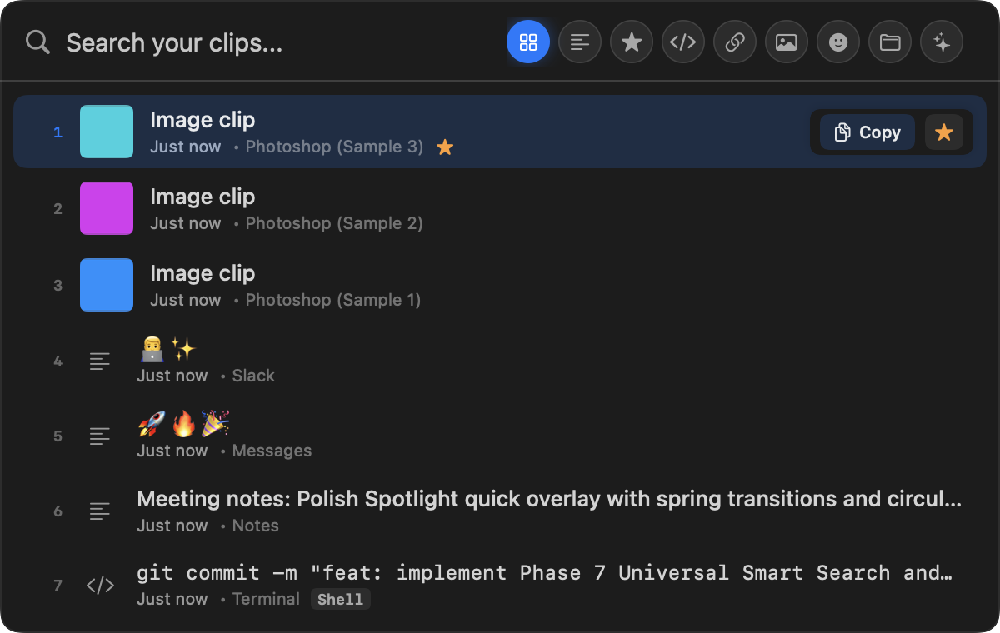

---

## ✨ Features

- **Spotlight-Style Quick Overlay**: Floating panel with search, keyboard navigation, and circular category filters.
- **Menu Bar Panel**: Fast access to recent clipboard history, favorites, and 3-column image gallery.
- **Deterministic Content Classification**: Automatically identifies and categorizes Text, Code, Prompts, URLs, Emoji, and Images locally.
- **Universal Smart Search**: Instant local search combining full-text keywords, category tags, language identifiers, domains, and starred status.
- **Background Quick Capture**: Capture selected content from any application using global hotkeys or modifier gestures without modifying your system clipboard.
- **Native Drag & Drop**: Drag text, links, or image thumbnails directly into any macOS application.
- **Privacy First**: 100% on-device SQLite storage, zero cloud accounts, and no external AI servers.
- **Centralized Display Limits**: Ultra-responsive UI displaying the top 30 items in "All" and 20 items per category.

---

## 🧠 Smart Content Classification

ClipBo analyzes copied content locally using a deterministic rule engine—no cloud API or external machine learning model is required.

| Content Example | Category | Classification Details |
|---|---|---|
| `func fetchUser() async -> User` | `<> Code` | Matches language syntax, keywords, braces, indentation, and structure |
| `"Act as a senior software architect..."` | `✦ Prompt` | Identifies instruction markers, persona prefixes, and query phrasing |
| `https://github.com/Ram-Dev-tech/ClipBo` | `URL` | Validates URI schemes, domain structures, and web endpoints |
| `🎉 🚀 ✨ 💡` | `😊 Emoji` | Detects isolated emoji sequences and multi-character glyphs |
| `"Meeting notes from sync with design team"` | `Text` | Standard plain text, rich text (RTF), and formatted snippets |
| Raw PNG / JPEG / TIFF / File Promise | `Images` | High-performance thumbnailing and resolution extraction |

> **Prompt vs. Code Arbitration**: When content contains both code and instruction phrases, ClipBo evaluates structural density vs. natural language intent to assign the most useful category.

---

## 🔎 Universal Smart Search

ClipBo features a local search ranking engine that parses multi-token queries across content, categories, starred status, and metadata:

- `code python` — Finds Python code snippets
- `prompt writing` — Filters AI prompts related to writing
- `star code` — Displays starred code clips
- `url github` — Finds GitHub URLs
- `star prompt` — Shows your favorite prompts

Relevance ranking prioritizes exact prefix matches, title matches, token matches, and recency **before** applying per-category display limits.

---

## ⚡ Quick Capture

ClipBo provides two background capture mechanisms that read selected content directly via macOS Accessibility APIs without simulating `⌘C` or altering your clipboard.

### 1. Manual Quick Capture (`⌥⌘C`)
Pressing **Option + Command + C** captures the currently selected text or image in the frontmost application.

### 2. Command + Selection Capture (`⌘ + Select`)
Hold **Command** (or your configured modifier) while highlighting text or an exposed image with the mouse or trackpad. When you release the selection, ClipBo automatically captures and classifies the snippet.

- **Zero Clipboard Modifications**: Bypasses `NSPasteboard` completely.
- **Non-Activating**: Never steals focus from your active workspace.
- **Duplicate Prevention**: Consecutive identical selections are automatically ignored.

---

## 🎨 Native macOS Interface

Designed exclusively for macOS, ClipBo adopts Apple's Human Interface Guidelines with vibrant glassmorphism, native typography, dark/light theme support, and fluid micro-animations.

| Dark Theme | Light Theme |
|---|---|
| 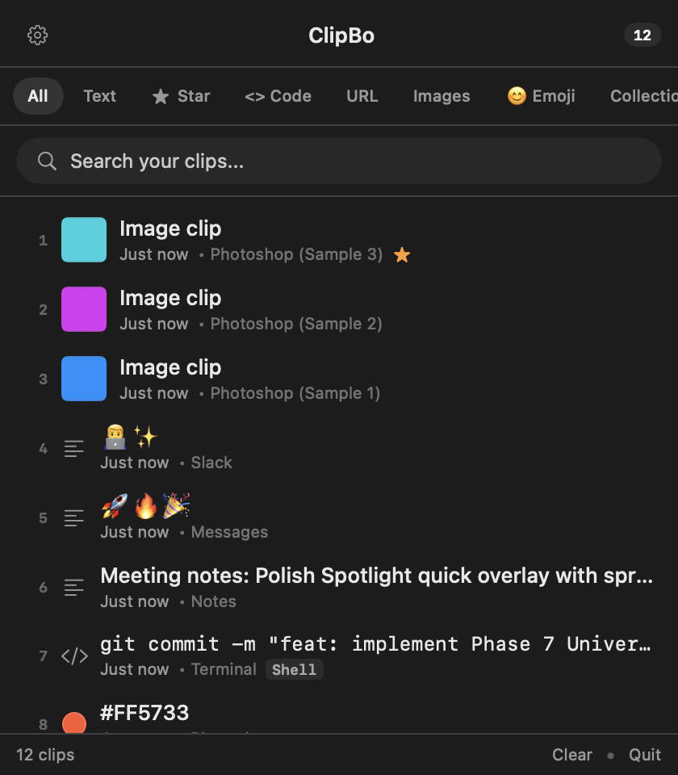 | 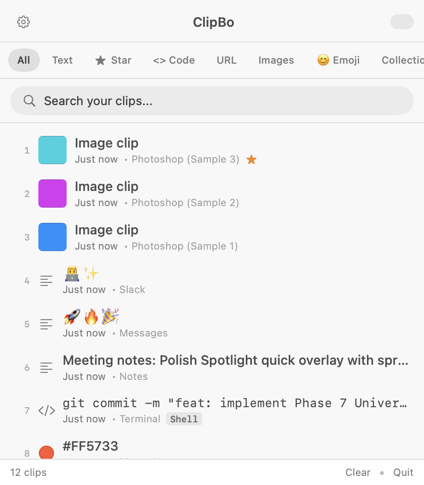 |

---

## 🗂 Categories

ClipBo organizes your clipboard history with built-in and customizable categories:

- **All**: Aggregated chronological timeline of all recent clips (top 30 displayed).
- **Text**: Notes, paragraphs, and formatted rich text.
- **★ Star**: Pinned clips protected from automatic retention pruning.
- **<> Code**: Code snippets with monospace formatting.
- **✦ Prompt**: AI workflows, LLM instructions, and queries.
- **URL**: Web links with domain extraction.
- **Images**: Dedicated gallery with thumbnail preview.
- **😊 Emoji**: Quick-access emoji sequences.
- **Collections**: Grouped clip collections.

### Custom Categories
In **Settings → Categories**, you can create custom categories, assign SF Symbols, reorder the circular navigation, and toggle categories on or off.

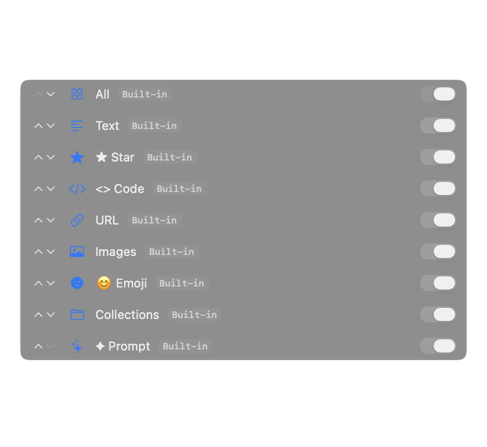

---

## ⭐ Favorites / Starred Clips

Click the star icon or press the favorite shortcut on any clip to pin it. Starred clips:
- Are highlighted with a gold star badge.
- Are immediately filterable under the **Star** category.
- **Are protected from automatic retention cleanup**, ensuring your saved snippets are never deleted.

---

## 🖼 Images

Images copied to the clipboard are stored locally in the application support directory:
- Rendered in a high-density 3-column thumbnail grid in the Menu Bar Panel.
- Displays resolution metadata (e.g. `1920 × 1080`).
- Supports double-click to restore image to clipboard.
- Native drag-and-drop support into Finder, Mail, Slack, Photoshop, and other apps.

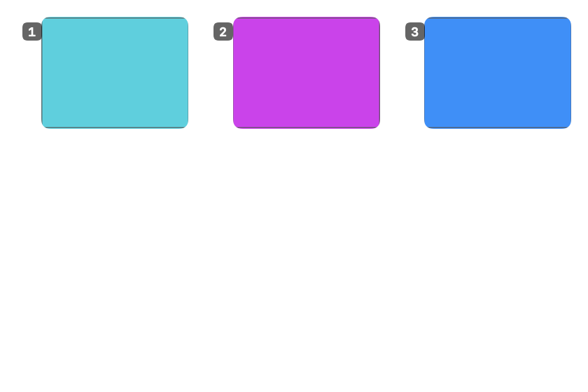

---

## 🖱 Drag & Drop

Every clip row supports native macOS AppKit drag-and-drop sessions (`NSDraggingItem`):
- **Text & Code**: Drags as plain text or UTF-8 string payload.
- **URLs**: Drags as native clickable macOS URL links.
- **Images**: Drags as temporary image files with live thumbnail dragging previews.

---

## ⌨️ Keyboard Shortcuts

| Action | Default Shortcut | Customizable in Settings |
|---|---|:---:|
| **Open Quick Overlay** | `⌘ ⇧ V` | Yes |
| **Manual Quick Capture** | `⌥ ⌘ C` | Yes |
| **Quick Selection Capture** | `⌘ + Select` | Yes (`⌘`, `⌥`, `⌃`, `⇧`) |
| **Open Menu Bar Panel** | `⌘ ⇧ C` | Yes |
| **Navigate Results** | `↑` / `↓` (with wrap-around) | Built-in |
| **Switch Categories** | `←` / `→` (circular cycling) | Built-in |
| **Copy / Restore Selected Clip** | `Return` | Built-in |
| **Dismiss Overlay / Panel** | `Esc` | Built-in |

---

## ⚙️ Settings

Configure shortcuts, retention limits, typography scale, categories, and review live diagnostics.

| Settings Panel | Help & Diagnostics |
|---|---|
| 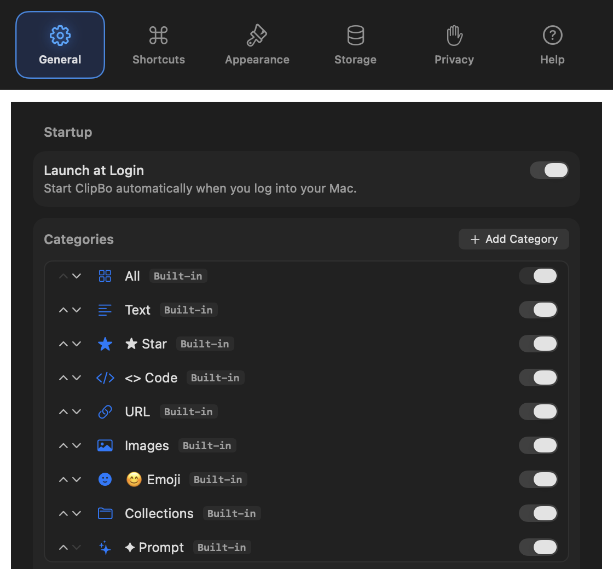 | 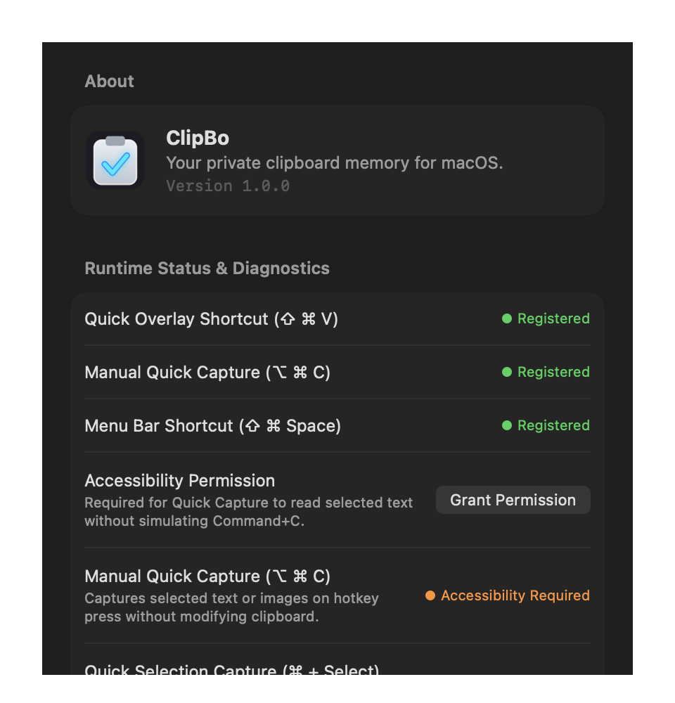 |

---

## 🔐 Privacy

ClipBo is engineered around a strict local-first privacy architecture:
- **On-Device Only**: Clipboard history is stored locally in an encrypted CoreData SQLite database.
- **Zero Cloud AI**: Content classification runs entirely on-device via native Swift regex and heuristic parsers.
- **No Telemetry**: ClipBo contains zero tracking, analytics, or third-party monitoring SDKs.
- **Optional Network Access**: URL title/favicon fetching is disabled by default. If enabled, only standard HTTP GET requests for page titles are made.
- **No Keystroke Logging**: ClipBo only observes pasteboard change counts and Accessibility selection queries when triggered.

---

## 📴 Completely Offline

ClipBo works 100% offline. You can use search, classification, drag-and-drop, category organization, and quick capture with your network connection completely disabled.

---

## 💾 Storage Efficiency

- **CoreData SQLite Engine**: Indexed queries with fast full-text searching.
- **Dual Retention Enforcement**: Retain clips by maximum count (100, 500, 1000, or Unlimited) and maximum age (7, 30, 90 days).
- **Starred Protection**: Starred/favorite clips are never automatically pruned.
- **Orphan Image Pruning**: Deleted image clips automatically purge associated disk files to prevent storage bloat.

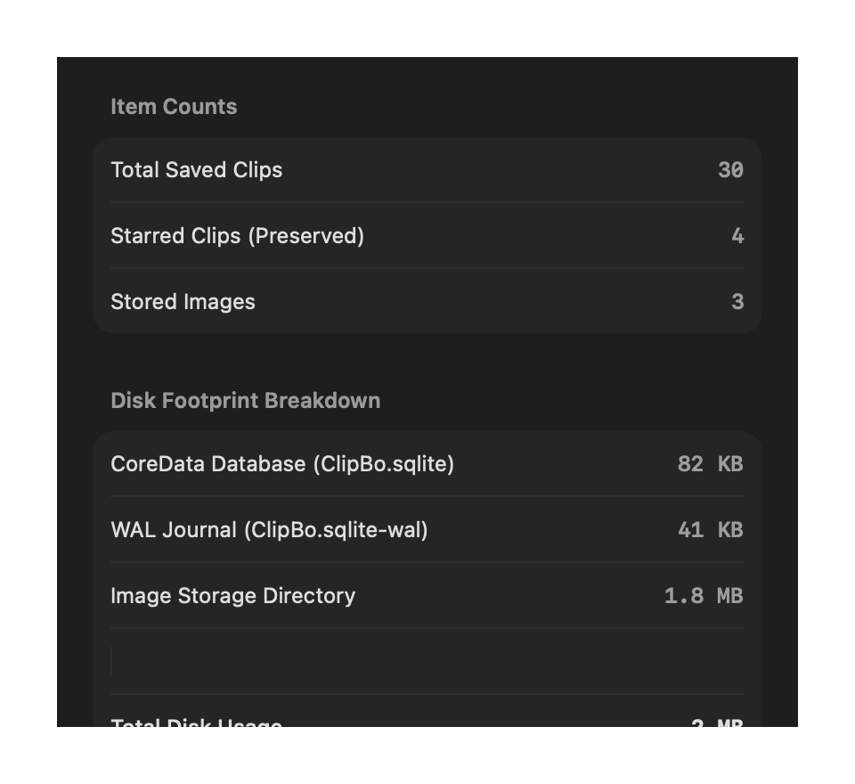

---

## 🖥 Requirements

- **Operating System**: macOS 14.0 (Sonoma) or later (compatible with macOS 13+).
- **Architecture**: Apple Silicon (M1/M2/M3/M4) & Intel 64-bit.
- **Permissions**:
  - Standard clipboard monitoring: **No special permissions required**.
  - Background Quick Capture (`⌥⌘C` and `⌘+Select`): **Accessibility permission** (`System Settings → Privacy & Security → Accessibility`).

---

## 📦 Installation & Setup

You can install and launch ClipBo directly using Terminal:

### One-Line Quick Install & Launch
```bash
git clone https://github.com/Ram-Dev-tech/ClipBo.git && cd ClipBo && ./scripts/build_app.sh && cp -R build/ClipBo.app /Applications/ && open /Applications/ClipBo.app
```

### Step-by-Step Installation
1. **Clone the Repository**:
   ```bash
   git clone https://github.com/Ram-Dev-tech/ClipBo.git
   cd ClipBo
   ```
2. **Build & Assemble Application Bundle**:
   ```bash
   ./scripts/build_app.sh
   ```
3. **Move to Applications Folder**:
   ```bash
   cp -R build/ClipBo.app /Applications/
   ```
4. **Launch ClipBo**:
   ```bash
   open /Applications/ClipBo.app
   ```
5. *(Optional for Quick Capture)*: Enable Accessibility permission in **System Settings → Privacy & Security → Accessibility → ClipBo** (required only for `⌥⌘C` and `⌘+Select` background capture).

---

## 🚀 Getting Started

1. **Copy Content**: Copy text, links, or code in any app (`⌘C`).
2. **Open Quick Overlay**: Press `⌘⇧V` to open the Spotlight-style overlay.
3. **Search & Filter**: Type keywords or press `←` / `→` to switch categories.
4. **Paste**: Press `Return` or double-click to restore any clip to your clipboard.
5. **Quick Capture**: Highlight text in another application and press `⌥⌘C` or hold `⌘` while dragging to capture directly into ClipBo without copying.

---

## 🛠 Build From Source

### Prerequisites
- macOS 14.0 or later
- Xcode 15.0+ or Swift 5.9+ command-line tools

### Build & Package Application
```bash
# 1. Clone repository
git clone https://github.com/Ram-Dev-tech/ClipBo.git
cd ClipBo

# 2. Build and assemble signed ClipBo.app
./scripts/build_app.sh
```
The compiled bundle will be generated at `build/ClipBo.app`.

---

## 🧪 Testing

ClipBo contains 19 automated test suites verifying storage, classification, search, navigation, drag-and-drop, and background capture:

```bash
swift run ClipBoTests
```

### Continuous Background Git Backup
```bash
# Start background watcher
./scripts/git_auto_sync.sh start

# Check sync status
./scripts/git_auto_sync.sh status

# Stop background watcher
./scripts/git_auto_sync.sh stop

# Force manual sync
./scripts/git_sync_now.sh
```

---

## 📸 Screenshots

| Quick Overlay (Search) | Quick Overlay (Prompt) |
|---|---|
|  | 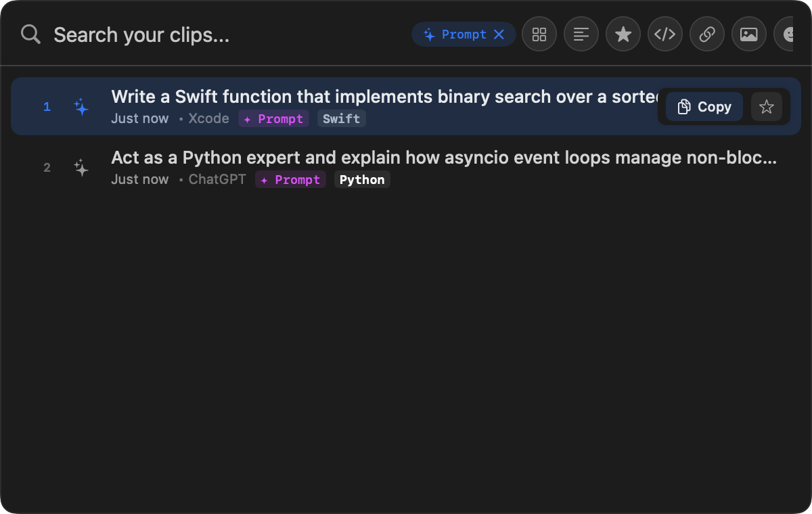 |

| Quick Overlay (Emoji) | Quick Overlay (Light) |
|---|---|
| 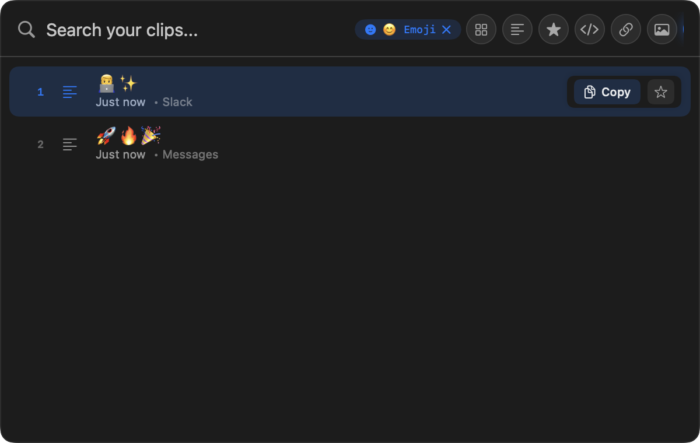 | 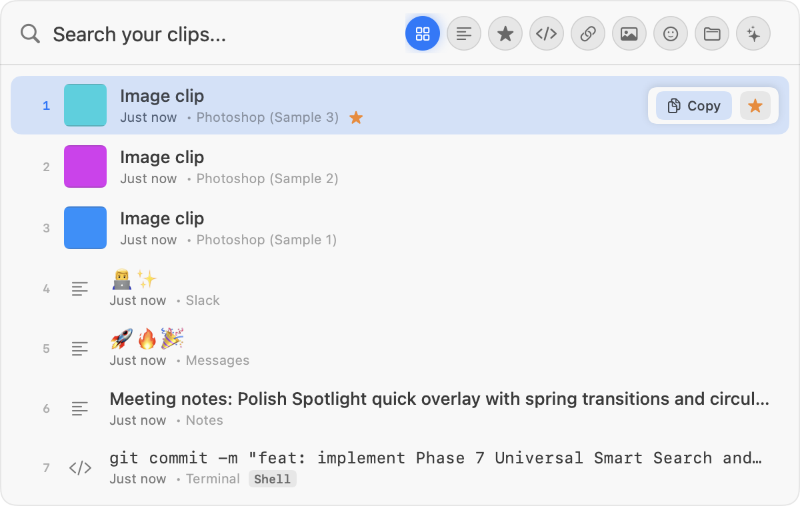 |

---

## 🏗 Architecture

```
                       ┌────────────────────────────┐
                       │ System Pasteboard (NSPaste) │
                       └─────────────┬──────────────┘
                                     │
                                     ▼
                       ┌────────────────────────────┐
┌──────────────────┐   │      ClipboardReader       │
│  Accessibility   │──▶│             or             │
│  Quick Capture   │   │  SelectionCaptureService   │
└──────────────────┘   └─────────────┬──────────────┘
                                     │
                                     ▼
                       ┌────────────────────────────┐
                       │     PasteboardPayload      │
                       └─────────────┬──────────────┘
                                     │
                                     ▼
                       ┌────────────────────────────┐
                       │   DefaultContentClassifier │
                       │ (Text/Code/Prompt/URL/Img) │
                       └─────────────┬──────────────┘
                                     │
                                     ▼
                       ┌────────────────────────────┐
                       │    CoreData SQLite Repo    │
                       │    + ImageStorage (Disk)   │
                       └─────────────┬──────────────┘
                                     │
             ┌───────────────────────┴───────────────────────┐
             ▼                                               ▼
┌─────────────────────────┐                     ┌─────────────────────────┐
│     Menu Bar Panel      │                     │   Quick Overlay Panel   │
│  (History/Gallery/Favs) │                     │ (Spotlight Search/Nav)  │
└─────────────────────────┘                     └─────────────────────────┘
```

---

## 🔒 Privacy Architecture

```
[Normal Copy Gesture] ──▶ NSPasteboard ──▶ ClipboardReader ──▶ Local Classifier ──▶ Encrypted CoreData
                                                                                         ▲
[Quick Capture / ⌘]   ──▶ macOS AX API ──▶ SelectionService ──▶ Local Classifier ────────┘
                                                               (Zero Cloud / No AI APIs)
```

---

## ❓ Troubleshooting

### Quick Capture shows "Accessibility Permission Required"
Open **System Settings → Privacy & Security → Accessibility**, locate **ClipBo**, and toggle the switch to **On**. If permission was just granted, ClipBo detects it immediately without requiring an app restart.

### Global shortcut is not responding
Open **ClipBo Settings → Shortcuts** and verify that no other application is using the same key combination. Click **Restore Defaults** to reset all shortcuts to standard values.

### App icon is not updating in Finder
macOS aggressively caches application icons. If the icon does not immediately appear after building from source, run:
```bash
sudo touch /Applications/ClipBo.app
killall Finder
```

---

## 📄 License

This project is licensed under the MIT License — see the [LICENSE](LICENSE) file for details.
