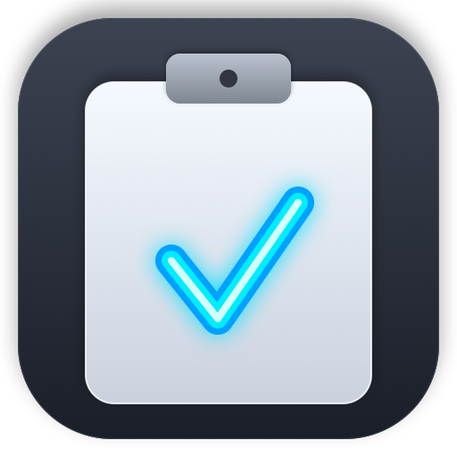
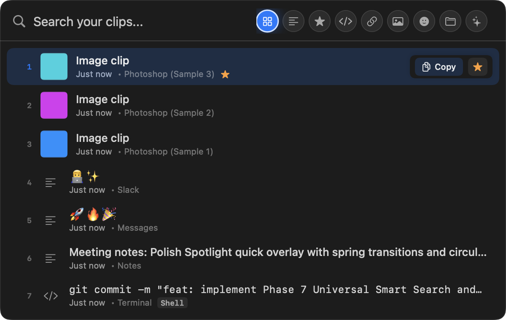

<p align="center">
  
</p>

# ClipBo

> A fast, private, offline-first clipboard manager for macOS.

[](https://www.apple.com/macos/)
[-informational.svg?style=flat-square)](https://www.apple.com/mac/)
[](https://swift.org)
[](docs/screenshots/)
[](https://github.com/Ram-Dev-tech/ClipBo/releases/tag/v0.6.4)
[](LICENSE)


---

## 📥 Download

### Latest Release (v0.6.4)

| Download Option | Link | File Size | Description |
| :--- | :--- | :--- | :--- |
| **Direct Download (DMG)** | **[Download ClipBo.dmg](https://github.com/Ram-Dev-tech/ClipBo/raw/main/dist/ClipBo.dmg)** | `2.6 MB` | Direct download from repository `dist/` |
| **GitHub Releases** | **[ClipBo.dmg (v0.6.4)](https://github.com/Ram-Dev-tech/ClipBo/releases/download/v0.6.4/ClipBo.dmg)** | `2.6 MB` | Official GitHub Release binary |
| **Browse Releases Folder** | **[Browse `dist/` Directory](dist/)** | — | View all release disk images in repository |

- **Format**: Standalone drag-to-install Apple Disk Image (`.dmg`)
- **System Requirements**: macOS 14.0 (Sonoma) or later (compatible with macOS 13+)
- **Hardware**: Apple Silicon (M1 / M2 / M3 / M4 / Pro / Max / Ultra)

---

## ✨ Features

- **Spotlight-Style Quick Overlay**: Floating panel (`⌘⇧V`) with search, keyboard arrow navigation, and circular category filters.
- **Menu Bar Panel**: Fast access (`⌘⇧C`) to recent clipboard history, favorites, and 3-column image gallery.
- **Deterministic Content Classification**: Automatically identifies and categorizes Text, Code, Prompts, URLs, Emoji, and Images locally.
- **Universal Smart Search**: Instant local search combining full-text keywords, category tags, language identifiers, domains, and starred status.
- **Background Quick Capture**: Capture selected content from any application using global hotkeys (`⌥⌘C`) or modifier drag gestures (`⌘ + Select`) without modifying your system clipboard.
- **Native Drag & Drop**: Drag text, links, or image thumbnails directly into any macOS application.
- **Privacy First**: 100% on-device SQLite storage, zero cloud accounts, and no external AI servers.
- **Centralized Display Limits**: Ultra-responsive UI displaying the top 30 items in "All" and 20 items per category.

---

## 🎨 Native macOS Interface

Designed exclusively for macOS, ClipBo adopts Apple's Human Interface Guidelines with vibrant glassmorphism, native typography, dark/light theme support, and fluid micro-animations.

| Dark Theme | Light Theme |
|:---:|:---:|
|  |  |
|  |  |

---

## 🧠 Smart Classification

ClipBo analyzes copied content locally using a deterministic rule engine—no cloud API or external machine learning model is required.

| Content Example | Category | Classification Details |
|---|---|---|
| `func fetchUser() async -> User` | `<> Code` | Matches language syntax, keywords, braces, indentation, and structure |
| `"Act as a senior software architect..."` | `✦ Prompt` | Identifies instruction markers, persona prefixes, and query phrasing |
| `https://github.com/Ram-Dev-tech/ClipBo` | `URL` | Validates URI schemes, domain structures, and web endpoints |
| `🎉 🚀 ✨ 💡` | `😊 Emoji` | Detects isolated emoji sequences and multi-character glyphs |
| `"Meeting notes from sync with design team"` | `Text` | Standard plain text, rich text (RTF), and formatted snippets |
| Raw PNG / JPEG / TIFF / File Promise | `Images` | High-performance thumbnailing and resolution extraction |

| Prompt Classification | Emoji Classification |
|:---:|:---:|
|  |  |

> **Prompt vs. Code Arbitration**: When content contains both code and instruction phrases, ClipBo evaluates structural density vs. natural language intent to assign the most useful category.

---

## 🔎 Smart Search

ClipBo features a local search ranking engine that parses multi-token queries across content, categories, starred status, and metadata:

- `code python` — Finds Python code snippets
- `prompt writing` — Filters AI prompts related to writing
- `star code` — Displays starred code clips
- `url github` — Finds GitHub URLs
- `star prompt` — Shows your favorite prompts



Relevance ranking prioritizes exact prefix matches, title matches, token matches, and recency **before** applying per-category display limits.

---

## ⚡ Quick Capture

ClipBo provides two background capture mechanisms that read selected content directly via macOS Accessibility APIs without simulating `⌘C` or altering your clipboard.

### 1. Manual Quick Capture (`⌥⌘C`)
Pressing **Option + Command + C** captures the currently selected text or image in the frontmost application.

### 2. Command + Selection Capture (`⌘ + Select`)
Hold **Command** (or your configured modifier) while highlighting text or an exposed image with the mouse or trackpad. When you release the selection, ClipBo automatically captures and classifies the snippet.

- **Zero Clipboard Modifications**: Bypasses `NSPasteboard` completely.
- **Non-Activating**: Never steals focus from your active workspace.
- **Duplicate Prevention**: Consecutive identical selections are automatically ignored.

---

## 🖱️ Drag & Drop

Every clip row supports native macOS AppKit drag-and-drop sessions (`NSDraggingItem`):
- **Text & Code**: Drags as plain text or UTF-8 string payload.
- **URLs**: Drags as native clickable macOS URL links.
- **Images**: Drags as temporary image files with live thumbnail dragging previews.

---

## 🔐 Privacy & Offline Architecture

ClipBo is engineered around a strict local-first privacy architecture:
- **On-Device Only**: Clipboard history is stored locally in an encrypted CoreData SQLite database.
- **Zero Cloud AI**: Content classification runs entirely on-device via native Swift regex and heuristic parsers.
- **No Telemetry**: ClipBo contains zero tracking, analytics, or third-party monitoring SDKs.
- **Optional Network Access**: URL title/favicon fetching is disabled by default. If enabled, only standard HTTP GET requests for page titles are made.
- **No Keystroke Logging**: ClipBo only observes pasteboard change counts and Accessibility selection queries when triggered.

```
[Normal Copy Gesture] ──▶ NSPasteboard ──▶ ClipboardReader ──▶ Local Classifier ──▶ CoreData SQLite
                                                                                          ▲
[Quick Capture / ⌘]   ──▶ macOS AX API ──▶ SelectionService ──▶ Local Classifier ────────┘
                                                               (100% Local / Zero Cloud)
```

---

## 📦 Installation

### Recommended — Download the DMG

For normal users who want to run ClipBo on their Mac:

1. **Download the DMG**:
   Download the latest **[ClipBo.dmg](https://github.com/Ram-Dev-tech/ClipBo/releases/download/v0.6.4/ClipBo.dmg)** release artifact.
2. **Open the DMG**:
   Double-click `ClipBo.dmg` to mount the installer.
3. **Drag to Applications**:
   Drag **ClipBo.app** onto the **Applications** folder alias.
4. **Launch ClipBo**:
   Open **Applications → ClipBo** (or launch via Spotlight: `⌘ Space` → `ClipBo`).
5. **Eject Installer**:
   Eject the `ClipBo` disk image from Finder.

---

### First Launch

- **Menu Bar App**: ClipBo is a lightweight menu bar utility. When launched, the ClipBo icon appears in the macOS top menu bar (it does not remain in the Dock).
- **Background Clipboard Monitoring**: Standard clipboard history capture starts working immediately in the background without needing any extra permissions.
- **Accessibility Permission**:
  - Required **only** for background Quick Capture (`⌥⌘C`) and Command + Selection Capture (`⌘ + Select`).
  - Standard clipboard history capture does **not** require Accessibility.
  - To enable Quick Capture: Open **System Settings → Privacy & Security → Accessibility → ClipBo** and toggle to **On**.

---

### macOS Security & Gatekeeper Note

ClipBo release builds are ad-hoc code-signed with a persistent developer identifier (`com.clipbo.app`). Because ClipBo is an open-source project distributed directly outside the Mac App Store without an Apple Developer ID notarization ticket:

- On first launch, macOS Gatekeeper may display a prompt stating that the developer cannot be verified.
- **To open safely**:
  1. Right-click (or Control-click) **ClipBo.app** in your `/Applications` folder and select **Open**.
  2. Click **Open** in the confirmation dialog.
  3. Alternatively, navigate to **System Settings → Privacy & Security**, scroll down to the Security section, and click **Open Anyway** next to ClipBo.
- *Note: We never recommend disabling macOS Gatekeeper globally via Terminal commands.*

---

### Uninstall

1. Quit ClipBo from the menu bar (Click Menu Bar Icon → Gear Menu → **Quit ClipBo**).
2. Open `/Applications` in Finder.
3. Drag **ClipBo.app** to the Trash.

*(Optional)* To remove local clip history and preferences:
```bash
# Remove local database and image cache
rm -rf "$HOME/Library/Application Support/ClipBo"

# Remove application preferences
defaults delete com.clipbo.settings 2>/dev/null || true
```

---

## 🧑‍💻 Build from Source

For developers who want to compile ClipBo locally using the Swift toolchain:

### Prerequisites
- macOS 14.0 or later
- Xcode 15.0+ or Swift 5.9+ command-line tools

### Build & Run
```bash
# 1. Clone the repository
git clone https://github.com/Ram-Dev-tech/ClipBo.git
cd ClipBo

# 2. Build the application bundle
./scripts/build_app.sh

# 3. Launch the built app
open build/ClipBo.app
```

### Run Automated Tests
ClipBo includes 19 automated test suites verifying storage, classification, search, navigation, drag-and-drop, and capture:
```bash
swift run ClipBoTests
```

---

## 🛠️ Create a DMG

For release maintainers to produce clean, reproducible macOS distribution DMGs:

```bash
# Option A: Full end-to-end clean release build (Cleans, Tests, Builds App & Creates DMG)
./scripts/release.sh

# Option B: Create DMG from an existing build/ClipBo.app
./scripts/create_dmg.sh
```

The installer will be generated at:
```
dist/ClipBo.dmg         # Primary release artifact
dist/ClipBo-0.6.4.dmg   # Versioned artifact
```

---

## ⌨️ Keyboard Shortcuts

| Action | Default Shortcut | Customizable in Settings |
|---|---|:---:|
| **Open Quick Overlay** | `⌘ ⇧ V` | Yes |
| **Manual Quick Capture** | `⌥ ⌘ C` | Yes |
| **Quick Selection Capture** | `⌘ + Select` | Yes (`⌘`, `⌥`, `⌃`, `⇧`) |
| **Open Menu Bar Panel** | `⌘ ⇧ C` | Yes |
| **Navigate Results** | `↑` / `↓` (with circular wrap) | Built-in |
| **Switch Categories** | `←` / `→` (circular cycling) | Built-in |
| **Copy / Restore Selected Clip** | `Return` | Built-in |
| **Dismiss Overlay / Panel** | `Esc` | Built-in |

---

## 🧩 Categories

- **All**: Aggregated chronological timeline of all recent clips (top 30 displayed).
- **Text**: Notes, paragraphs, and formatted rich text.
- **★ Star**: Pinned clips protected from automatic retention pruning.
- **<> Code**: Code snippets with monospace formatting.
- **✦ Prompt**: AI workflows, LLM instructions, and queries.
- **URL**: Web links with domain extraction.
- **Images**: Dedicated gallery with thumbnail preview.
- **😊 Emoji**: Quick-access emoji sequences.
- **Collections**: Grouped clip collections.

---

## 🗂️ Storage

- **CoreData SQLite Engine**: Indexed queries with fast full-text searching.
- **Dual Retention Enforcement**: Retain clips by maximum count (100, 500, 1000, or Unlimited) and maximum age (7, 30, 90 days).
- **Starred Protection**: Starred/favorite clips are never automatically pruned.
- **Orphan Image Pruning**: Deleted image clips automatically purge associated disk files to prevent storage bloat.
- **Disk Path**: `~/Library/Application Support/ClipBo/`


---

## 🐛 Troubleshooting

### Quick Capture shows "Accessibility Permission Required"
Open **System Settings → Privacy & Security → Accessibility**, locate **ClipBo**, and toggle the switch to **On**. If permission was just granted, ClipBo detects it immediately without requiring an app restart.

### Global shortcut is not responding
Open **ClipBo Settings → Shortcuts** and verify that no other application is using the same key combination. Click **Restore Defaults** to reset all shortcuts to standard values.

### App icon is not updating in Finder
macOS aggressively caches application icons. If the icon does not immediately appear after building from source, run:
```bash
sudo touch /Applications/ClipBo.app
killall Finder
```

---

## 💬 Community & Feedback

- **Issues & Bug Reports**: [GitHub Issues](https://github.com/Ram-Dev-tech/ClipBo/issues)
- **Discussions & Feature Requests**: [GitHub Discussions](https://github.com/Ram-Dev-tech/ClipBo/discussions)

---

## 🤝 Contributing

Contributions are welcome! Please feel free to open a Pull Request:
1. Fork the repository
2. Create your feature branch (`git checkout -b feature/amazing-feature`)
3. Ensure all tests pass (`swift run ClipBoTests`)
4. Commit your changes (`git commit -m 'Add amazing feature'`)
5. Push to the branch (`git push origin feature/amazing-feature`)
6. Open a Pull Request

---

## 📄 License

This project is licensed under the MIT License — see the [LICENSE](LICENSE) file for details.
